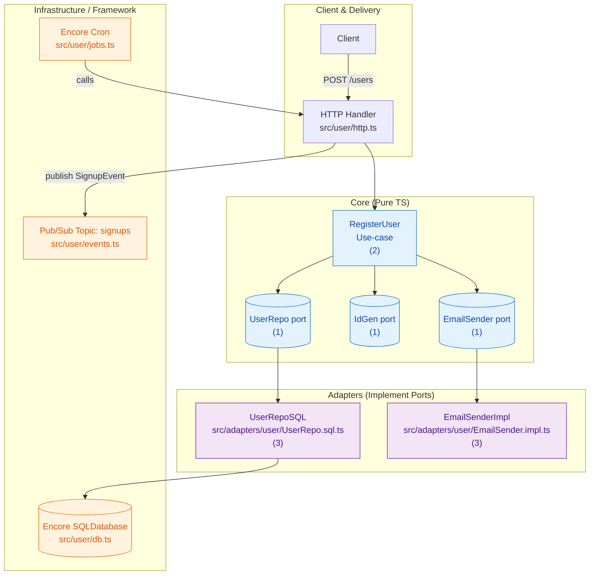
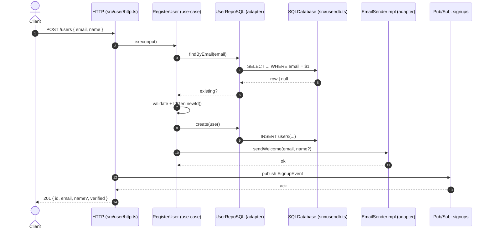

I'll first scan the repository to understand its architecture and layering so I can tailor the explanation and diagrams.

## Goal and Big Picture

This repo demonstrates a Clean Architecture / Ports & Adapters (Hexagonal) approach with a vertical-slice feature for “user” — keeping business logic pure, and pushing frameworks/infrastructure to the edges. The core decisions are:

- Keep use-cases “pure TS”: no framework, DB, or HTTP imports in your business logic
- Depend on ports (interfaces), not concrete tech (dependency inversion)
- Implement adapters at the edges to satisfy the ports (SQL, email, etc.)
- Compose wiring at delivery boundaries (HTTP, Pub/Sub, Cron) so the core remains swappable and testable

## Architecture at a Glance

Below is the module interaction overview. Core depends only on ports. Adapters implement ports and talk to infrastructure. Delivery (HTTP/Cron/PubSub) wires everything.



## Request Flow (Register User)

This shows how a single request flows across layers without leaking tech details into the core.



## The Layers and Their Responsibilities

### 1) Core (Domain + Application)
- What it is: Use-cases (application logic) and Ports (interfaces the core needs from the outside world)
- Key choices:
  - Pure TypeScript (no Encore, no SQL, no fetch)
  - Small, explicit API surface
  - Constructor injection for ports → easy to test

Code: ports define the “needs” of the core.

````ts path=src/app/user/ports.ts mode=EXCERPT
export interface UserRepo {
  create(u: { id: string; email: string; name?: string; verified: boolean }): Promise<void>;
  findByEmail(email: string): Promise<{ id: string; email: string; name?: string; verified: boolean } | null>;
  disableUnverifiedOlderThan(hours: number): Promise<number>;
}
````

Use-case uses only ports + TS primitives:

````ts path=src/app/user/usecases/RegisterUser.ts mode=EXCERPT
export class RegisterUser {
  constructor(private deps: { repo: UserRepo; id: IdGen; mail: EmailSender }) {}
  async exec(input: RegisterInput): Promise<RegisterOutput> {
    // validate, check duplicates, create, send email via port
  }
}
````

Note the explicit point in the file about “pure TS” use-cases — this is the core principle enabling portability, testability, and fast iteration.

### 2) Adapters (Implement the Ports)
- What it is: Framework/infra-aware modules that satisfy core ports
- Key choices:
  - Place all “how” here: SQL, secrets, fetch, email APIs, etc.
  - Adapters are replaceable; core remains unchanged

SQL adapter for the repo:

````ts path=src/adapters/user/UserRepo.sql.ts mode=EXCERPT
export const UserRepoSQL = (): UserRepo => ({
  async create(u) { await DB.exec`INSERT INTO users (id, email, name, verified) VALUES (${u.id}, ${u.email}, ${u.name ?? null}, ${u.verified})`; },
  async findByEmail(email) { const row = await DB.queryRow`SELECT id, email, name, verified FROM users WHERE email = ${email}`; return row ? { id: row.id, email: row.email, name: row.name ?? undefined, verified: row.verified } : null; },
});
````

Email adapter:

````ts path=src/adapters/user/EmailSender.impl.ts mode=EXCERPT
const SENDGRID_API_KEY = secret("SendgridApiKey");
export const EmailSenderImpl = (): EmailSender => ({
  async sendWelcome(to, name) { console.log("[EMAIL] Welcome", { to, name }); }
});
````

### 3) Delivery + Infrastructure
- What it is: HTTP handlers, Pub/Sub topics/subscriptions, Cron jobs, DB connections, secrets
- Key choices:
  - Wire concrete adapters to the use-case here
  - Emit/subscribe to events here
  - Keep endpoints idempotent for jobs

HTTP endpoint wires everything:

````ts path=src/user/http.ts mode=EXCERPT
const uc = new RegisterUser({ repo: UserRepoSQL(), id: IdGen, mail: EmailSenderImpl() });
const user = await uc.exec(req);
await signups.publish({ userID: user.id, email: user.email });
````

Pub/Sub:

````ts path=src/user/events.ts mode=EXCERPT
export const signups = new Topic<SignupEvent>("user-signups", { deliveryGuarantee: "at-least-once" });
new Subscription(signups, "send-welcome-secondary", { handler: async (evt) => { await EmailSenderImpl().sendWelcome(evt.email); }});
````

Cron:

````ts path=src/user/jobs.ts mode=EXCERPT
export const cleanupUnverified = api<void, void>({}, async () => { await UserRepoSQL().disableUnverifiedOlderThan(24); });
new CronJob("cleanup-unverified", { title: "Disable stale, unverified users", schedule: "0 3 * * *", endpoint: cleanupUnverified });
````

## Why These Decisions

- Dependency Inversion: The core defines interfaces; infrastructure conforms. This makes replacing infra (Sendgrid → SES, SQL → in-memory) low risk.
- Testability: You can test use-cases with in-memory fakes without running Encore or a database.

````ts path=src/tests/register_user.test.ts mode=EXCERPT
const uc = new RegisterUser({ repo: new InMemRepo(), id: IdGen, mail: Mail });
const out = await uc.exec({ email: "A@B.com", name: "Alice" });
expect(out).toEqual({ id: "id-1", email: "a@b.com", name: "Alice", verified: false });
````

- Separation of Concerns: Use-cases decide what should happen; adapters decide how it happens.
- Vertical Slice Clarity: Everything for “user” lives under src/user/* and its app/adapters, making ownership and navigation obvious.

## How to Add a New Feature (Recipe)

1) Define or reuse ports in app/<feature>/ports.ts
- Example: PaymentGateway, NotificationSender, etc.

2) Implement the use-case (pure TS) in app/<feature>/usecases/*
- Accept dependencies via constructor
- Encode business rules; no framework imports

3) Add adapters under adapters/<feature>/*
- Concrete SQL/HTTP/SDK implementations of the ports

4) Wire it up in delivery
- HTTP: src/<feature>/http.ts endpoint constructs use-case with concrete adapters
- Pub/Sub or Cron where needed

5) Test
- Unit: Use in-memory fakes for ports to test the use-case logic fast
- Integration: Optionally add tests hitting Encore endpoints with real adapters

## Trade-offs and Alternatives

- Slight upfront ceremony: You write interfaces and adapters, but you gain long-term flexibility and test speed.
- Cross-cutting concerns: Keep logging/metrics at adapters or delivery layers; add decorators if you need cross-cutting behavior without polluting core.
- Async side-effects: The use-case triggers side-effects via ports. For heavy work, prefer publishing a domain event in the handler and handle in a subscriber to keep latency low.

## Heuristics and Mental Model

- Business rules belong in use-cases; IO belongs in adapters
- Use-cases can run in a plain TS environment (node + Vitest) with no infra
- Delivery layers are the only place that “knows about everything”
- Ports evolve slowly; multiple adapters may implement the same port

## Quick Map of the User Slice

- Core
  - app/user/ports.ts: interfaces for Repo, IdGen, Email
  - app/user/usecases/RegisterUser.ts: main use-case
- Adapters
  - adapters/user/UserRepo.sql.ts: SQL implementation of UserRepo
  - adapters/user/EmailSender.impl.ts: ESP/console implementation of EmailSender
- Delivery + Infra
  - user/http.ts: HTTP endpoint wiring and event publishing
  - user/events.ts: topic + subscription for welcome flows
  - user/jobs.ts: cron job invoking an idempotent endpoint
  - user/db.ts + migrations/: SQL database and schema

## Anti-patterns to Avoid

- Importing Encore or infra directly in a use-case
- Returning framework-specific types from a use-case
- Having adapters call back into use-cases (invert flow: use-cases depend on ports only)
- Hidden global state in adapters (prefer instantiation + explicit dependencies)

## Next Step Options

- I can add a second use-case (e.g., VerifyUser) following the same pattern
- Or, we can swap EmailSenderImpl to a real Sendgrid API call and add a test double for it
- Or, we can add a simple read-model endpoint using the same Repo port

If you tell me which direction you’d like to practice (new use-case, new adapter, or a swap), I’ll walk you through it step by step and we can codify it together.
