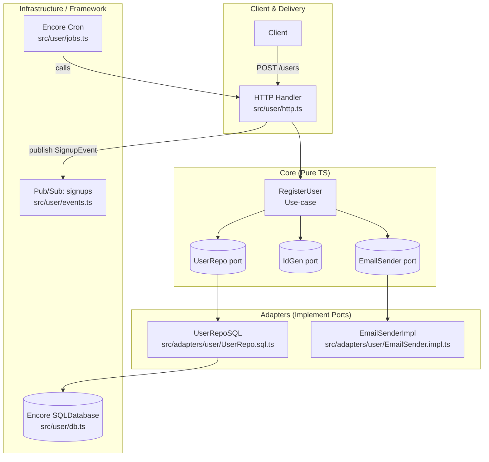
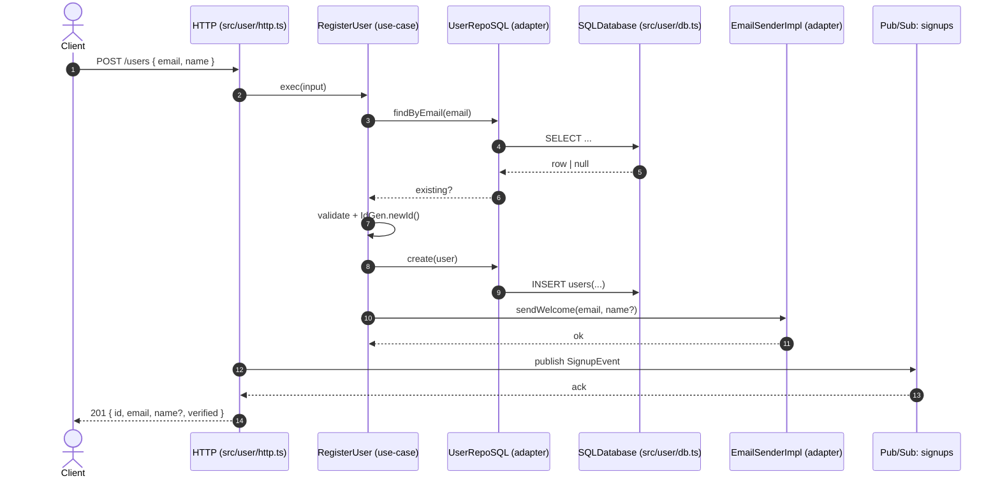

## Clean Architecture Pattern (Encore TS)

This repository demonstrates a Clean Architecture / Ports & Adapters (Hexagonal) approach on Encore with a vertical-slice feature for “user”. Core business logic is pure TypeScript and framework-agnostic; infrastructure is pushed to adapters and delivery layers.

- Pure core: no Encore/DB/HTTP imports in use-cases
- Depend on ports (interfaces), implemented by adapters
- Wire concrete adapters only at delivery boundaries (HTTP, Pub/Sub, Cron)

For detailed rules and enforcement ideas, see INSTRUCTION.md.

## Architecture at a glance

Core depends only on ports. Adapters implement ports and talk to infrastructure. Delivery (HTTP/Cron/PubSub) wires everything.



## Request flow (Register User)



## Project layout

- Core (pure): src/app/user
  - ports.ts, usecases/RegisterUser.ts
- Adapters (IO): src/adapters/user
  - UserRepo.sql.ts, EmailSender.impl.ts
- Delivery + Infra: src/user
  - http.ts, events.ts, jobs.ts, db.ts, migrations/
- Shared utilities: src/shared

## Developing locally

When you have installed Encore, you can create a new Encore app and clone an example with:

```bash
encore app create my-app-name --example=ts/empty
```

This repo is already structured for the pattern above.

## Running locally

```bash
encore run
```

While encore run is running, open http://localhost:9400 to view Encore’s local developer dashboard.

## Testing

- Fast unit tests for use-cases with in-memory fakes (no DB/framework required)
- Integration tests for adapters and delivery when needed

Run Encore tests:

```bash
encore test
```

## Environment configuration

- Create a .env file at the repo root for local development
- Add your secrets as KEY=VALUE lines

Example .env:

```bash
SENDGRID_API_KEY=your-local-key
```

At runtime, ensure these variables are present in the environment (e.g., dotenv loader or exported in shell/CI). See src/adapters/user/EmailSender.impl.ts for usage.

## Deployment

Deploy your application to a staging environment in Encore's free development cloud:

```bash
git add -A .
git commit -m "Commit message"
git push encore
```

Then head over to the Cloud Dashboard (https://app.encore.dev) to monitor your deployment and find your production URL. You can also connect your own AWS or GCP account for deployment.
